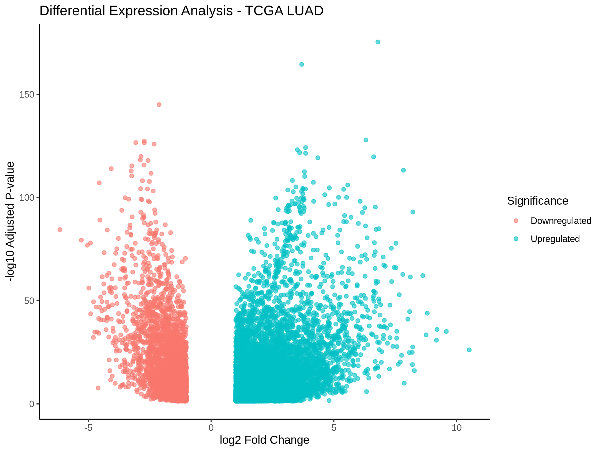

# 🧬 AI-Powered Cancer Biomarker Discovery Platform

An end-to-end computational biology platform for identifying and prioritizing cancer biomarkers using transcriptomic data, statistical genomics, functional enrichment analysis, and machine learning approaches.

---

# 📖 Project Overview

Cancer biomarker discovery is essential for understanding disease mechanisms, improving diagnosis, developing targeted therapies, and supporting precision medicine.

This project develops a reproducible bioinformatics workflow using publicly available cancer genomic datasets to identify potential molecular biomarkers associated with Lung Adenocarcinoma (LUAD).

The platform integrates:

- RNA-seq data analysis
- Differential gene expression analysis
- Functional pathway interpretation
- Biomarker prioritization
- Machine learning-based prediction
- Reproducible computational workflows

---

# 🔬 Research Question

**Can computational analysis of transcriptomic data identify potential molecular biomarkers and biological pathways associated with Lung Adenocarcinoma progression?**

---

# 🎯 Objectives

The main objectives of this project are:

✓ Identify significantly differentially expressed genes (DEGs)

✓ Discover potential cancer biomarkers

✓ Understand biological pathways involved in tumor progression

✓ Perform functional enrichment analysis

✓ Develop machine learning models for biomarker classification

✓ Create a reproducible research workflow

✓ Build an interactive AI-assisted biomarker discovery platform

---

# 🧬 Dataset

## Cancer Type

**Lung Adenocarcinoma (LUAD)**

## Data Source

- The Cancer Genome Atlas (TCGA)
- Publicly available transcriptomic datasets

## Analysis Type

RNA-seq gene expression analysis comparing:

- Tumor samples
- Normal tissue samples

---

# 🔬 Research Workflow
Public Cancer Genomic Data
│
▼
Data Import & Processing
│
▼
RNA-seq Expression Analysis
│
▼
Differential Expression Analysis
(DESeq2)
│
▼
Candidate Biomarker Identification
│
▼
Functional Enrichment
(GO / KEGG)
│
▼
Pathway Interpretation
│
▼
Protein Interaction Network
│
▼
Machine Learning Biomarker Selection
│
▼
Validation & Prediction
│
▼
AI-powered Biomarker Platform

---

# ✅ Completed Analysis

## 1. Differential Gene Expression Analysis

Tool:

- DESeq2
- Bioconductor
- R

Analysis performed:

- Statistical comparison of tumor vs normal expression profiles
- Identification of significantly altered genes
- Ranking based on:

  - log2 fold change
  - adjusted p-value
  - statistical significance

### Example identified candidate genes:

| Gene | Regulation |
|------|------------|
| FAM83A | Upregulated |
| PYCR1 | Upregulated |
| AFAP1-AS1 | Upregulated |
| TOP2A | Upregulated |
| IQGAP3 | Upregulated |
| PECAM1 | Downregulated |
| RGCC | Downregulated |
| S1PR1 | Downregulated |

---

# 📊 Differential Expression Visualization

Generated:

- Volcano plot
- Ranked DEG tables
- Candidate biomarker lists

---

# 🧬 Functional Enrichment Analysis

Performed biological interpretation using:

- clusterProfiler
- Gene Ontology (GO)
- KEGG pathway analysis

## GO Enrichment Results

Major enriched biological processes:

- Extracellular matrix organization
- Cell-cell adhesion
- Immune-related processes
- Cellular signaling regulation

---

# 🧪 KEGG Pathway Analysis

Significant pathways identified include:

- Neuroactive ligand-receptor interaction
- Hormone signaling pathways
- Immune-related pathways
- Disease-associated molecular pathways

---

# 📂 Repository Structure
Cancer_Biomarker_Discovery_Platform/

│
├── data/
│ ├── raw/
│ ├── processed/
│ └── metadata/
│
├── notebooks/
│ ├── 01_TCGA_LUAD_Data_Exploration.ipynb
│ ├── 02_data_import.ipynb
│ └── 02_Functional_Enrichment.ipynb
│
├── figures/
│ ├── Volcano_plot_TCGA_LUAD.png
│ ├── GO_enrichment_TCGA_LUAD.png
│ └── KEGG_pathway_TCGA_LUAD.png
│
├── results/
│ ├── Top_candidate_biomarkers_TCGA_LUAD.csv
│ └── enrichment/
│
├── docs/
│ └── TCGA_LUAD_Biomarker_Report.md
│
├── scripts/
│
└── README.md

---

# 🛠 Technologies Used

## Programming

- R
- Python
- Bash

## Bioinformatics

- DESeq2
- Bioconductor
- clusterProfiler
- org.Hs.eg.db
- KEGG
- Gene Ontology

## Data Science

- Pandas
- NumPy
- Scikit-learn
- Machine Learning

## Visualization

- ggplot2
- matplotlib
- Plotly

## Reproducibility

- Git
- GitHub
- Conda
- Jupyter Notebook

---

# 📈 Project Results

The first phase successfully generated:

✓ Differentially expressed gene profile

✓ Candidate cancer biomarkers

✓ Biological pathway interpretation

✓ GO enrichment results

✓ KEGG pathway analysis

✓ Publication-quality figures

✓ Reproducible computational environment

---

# 🚀 Next Development Phase

## Machine Learning Biomarker Prediction

Planned approaches:

- Random Forest classifier
- Support Vector Machine
- XGBoost
- Feature selection

Goals:

- Identify strongest biomarker combinations
- Build predictive models
- Evaluate model performance

---

# 🔬 Future Improvements

Future development includes:

- Protein-protein interaction networks
- Survival analysis using clinical data
- External dataset validation
- Single-cell RNA-seq integration
- Multi-omics analysis
- Explainable AI (XAI)
- Drug target prioritization
- Interactive Streamlit dashboard

---

# 📅 Development Roadmap

| Phase | Status |
|---|---|
| Project setup | ✅ Completed |
| Data import and processing | ✅ Completed |
| Differential expression analysis | ✅ Completed |
| GO enrichment | ✅ Completed |
| KEGG pathway analysis | ✅ Completed |
| Biomarker prioritization | ✅ Completed |
| PPI network analysis | 🔄 Next |
| Machine learning models | 🔄 Next |
| Validation | 🔄 Next |
| AI dashboard | 🔄 Future |

---

# 👩‍💻 Author

**Mehwish Shafiq**

Bioinformatics | Computational Biology | Cancer Genomics | Artificial Intelligence

GitHub:

https://github.com/Mehwish55

---

# ⭐ Project Status

🚧 Active Research Development

This project demonstrates the integration of molecular biology, bioinformatics, statistical genomics, and artificial intelligence approaches for cancer biomarker discovery and precision medicine applications.
