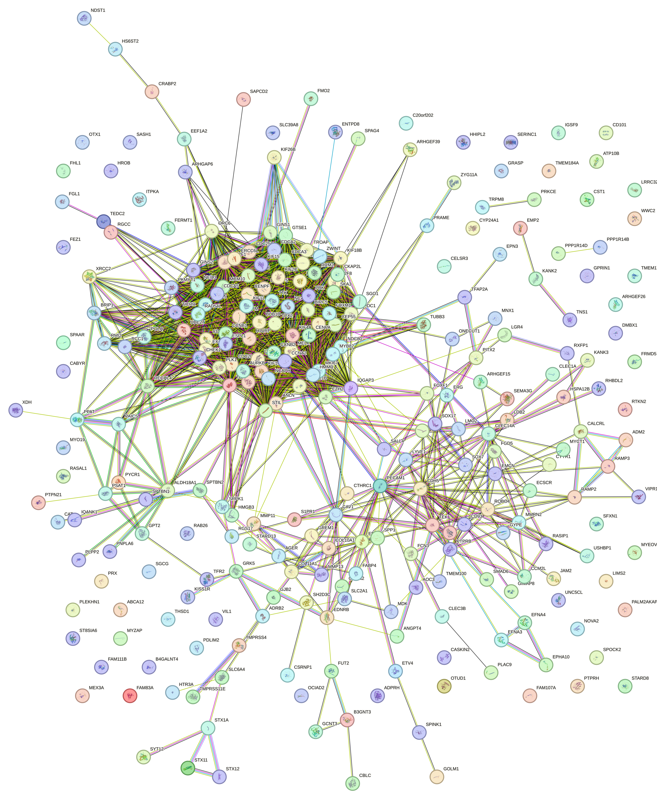
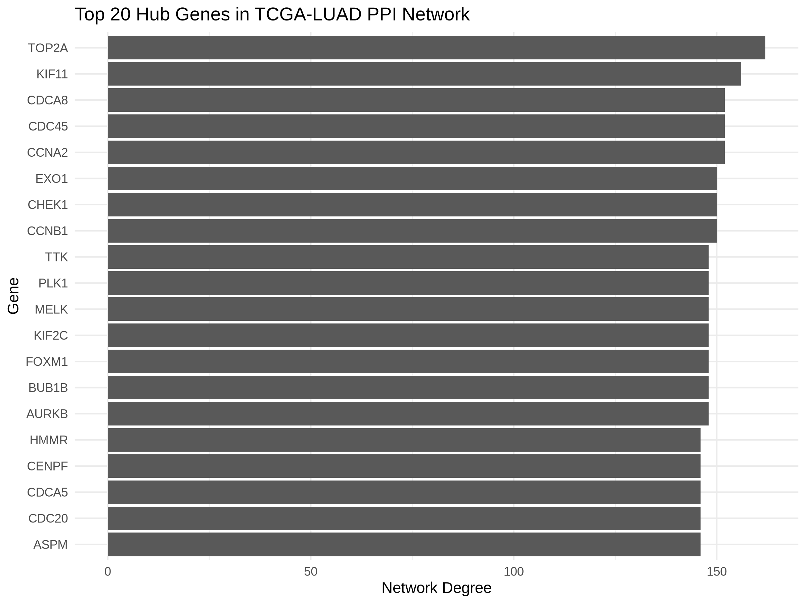
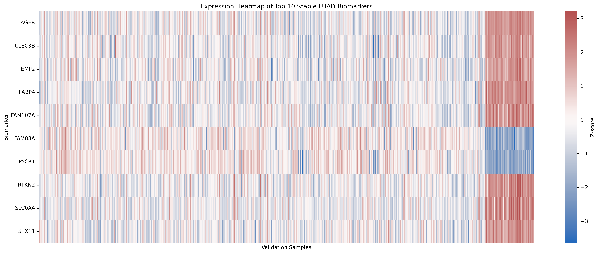
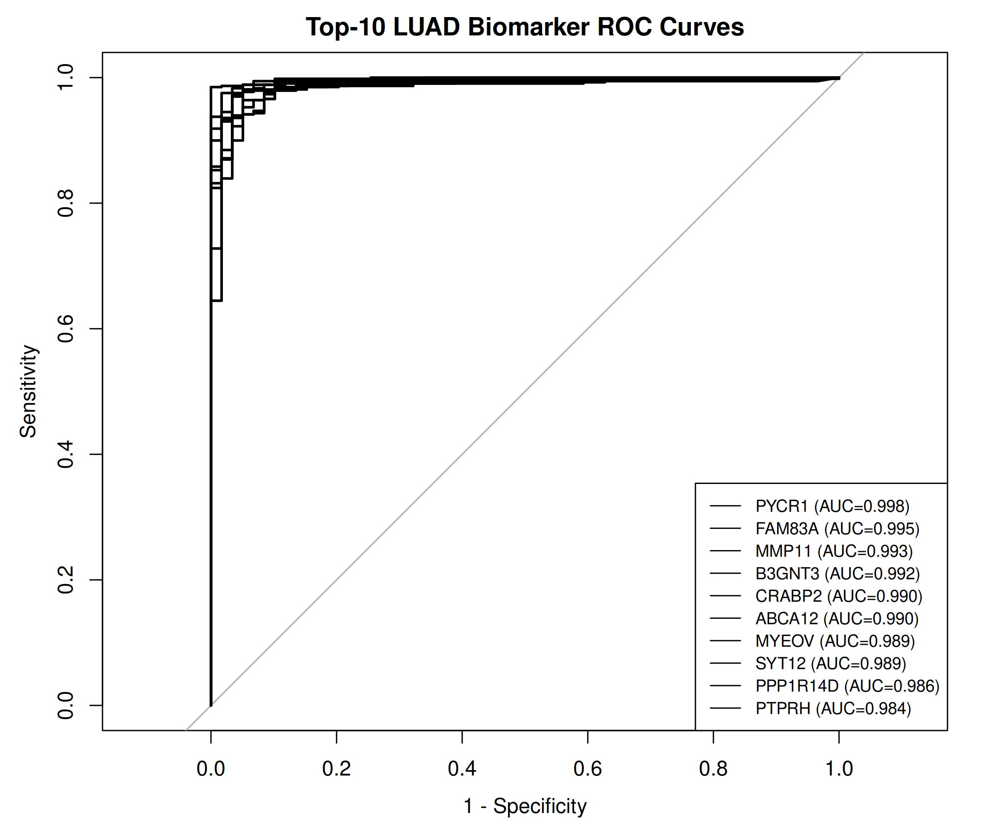
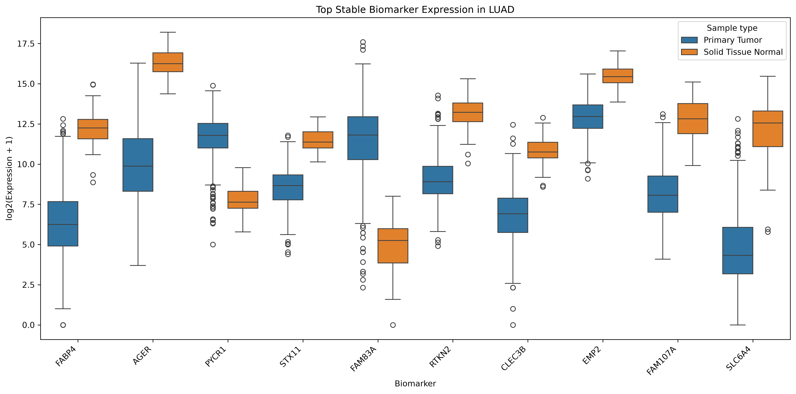
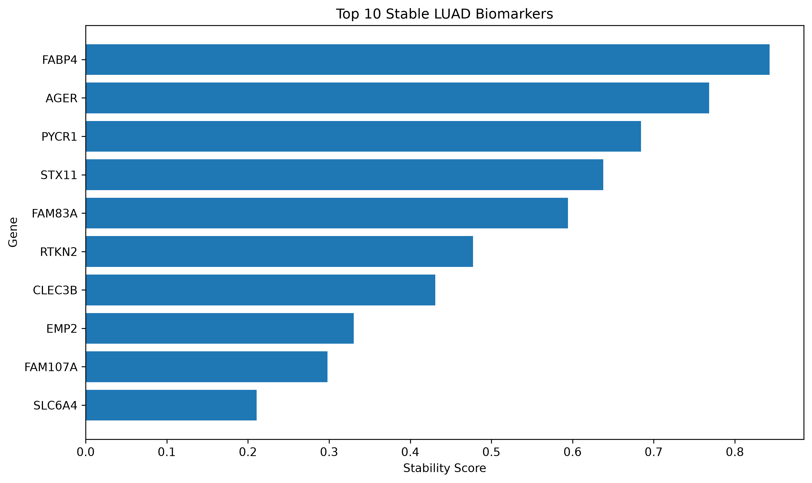
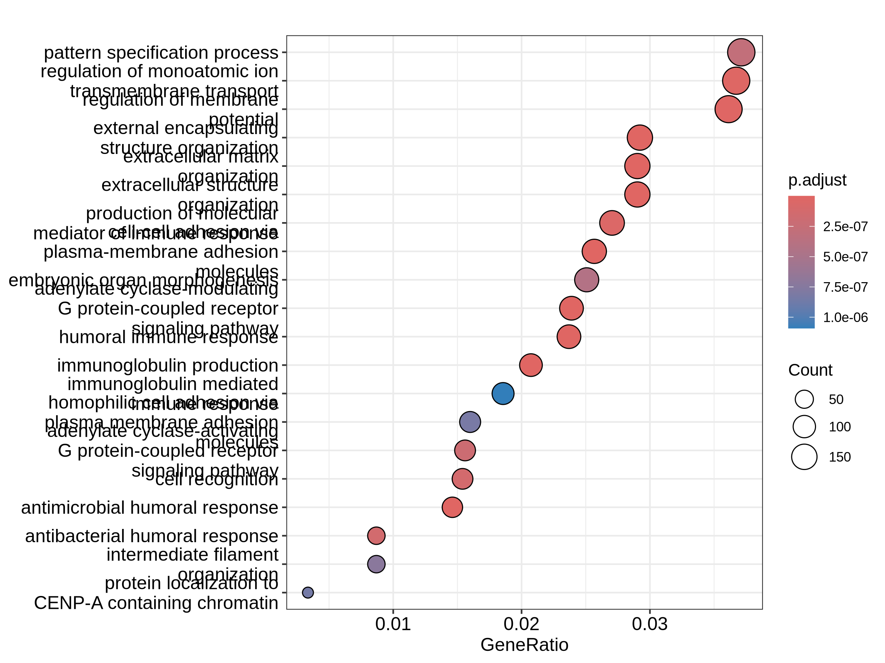
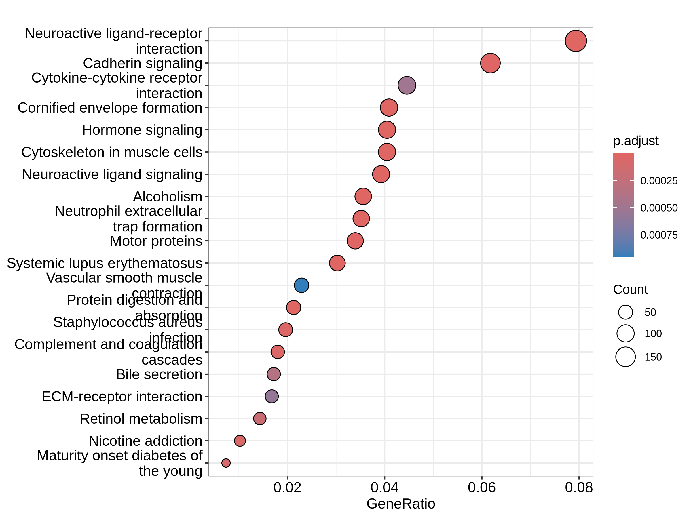

# 🧬 AI-Powered Cancer Biomarker Discovery Platform

An end-to-end computational biology and bioinformatics platform for **identifying, prioritizing, validating, and interpreting candidate cancer biomarkers** using transcriptomic data, statistical genomics, network biology, functional enrichment, and machine-learning-assisted analysis.

The current study focuses on **Lung Adenocarcinoma (LUAD)** using publicly available transcriptomic data.

---
## 🚀 Live Demo — Dashboard V2

The **Cancer Biomarker Discovery Platform V2** is now publicly deployed as an interactive Streamlit application.

👉 **[Launch the Live Dashboard](https://cancerbiomarkerdiscoveryplatform.streamlit.app/)**

### Platform capabilities

* 🧬 **Biomarker Explorer** — explore and rank candidate biomarkers
* 📊 **Differential Expression** — investigate LUAD gene-expression changes
* 🏆 **Integrated Biomarker Ranking** — combine multiple evidence sources
* 🤖 **Machine Learning** — evaluate biomarker prediction models
* 📈 **ROC Validation** — assess biomarker discriminatory performance
* 🔬 **Biomarker Stability** — evaluate ranking/stability across analyses
* 🧪 **Pathway Analysis** — explore GO Biological Process, Cellular Component, and Molecular Function
* 🛤️ **KEGG Pathway Analysis** — investigate enriched biological pathways
* 🔎 **Evidence Explorer** — integrate evidence for individual biomarkers
* 🤖 **AI Assistant** — generate responses grounded in the platform's validated biomarker evidence

### Validation

The V2 application includes automated tests covering:

* Dataset loading
* KEGG dataset integration
* Biomarker evidence retrieval
* Evidence existence validation
* AI grounding and source generation

**Current test status: 8/8 tests passing ✅**

### Technology Stack

**Bioinformatics:** R, DESeq2, pathway enrichment, biomarker validation
**AI/ML:** Python, scikit-learn, evidence-grounded AI workflows
**Data Analysis:** Python, pandas
**Visualization:** Plotly, Streamlit
**Deployment:** Streamlit Community Cloud
**Version Control:** Git, GitHub

### Project

**Cancer type:** Lung Adenocarcinoma (LUAD)
**Primary dataset:** TCGA-LUAD
**Platform version:** V2.0

> This platform presents computationally derived biomarker evidence and is intended for research and exploratory purposes. It does not provide clinical diagnostic recommendations.


## 📖 Project Overview

Cancer biomarker discovery is important for understanding disease biology, identifying diagnostic and prognostic candidates, and supporting precision medicine.

This project develops a reproducible computational workflow that integrates:

* RNA-seq gene expression analysis
* Differential gene expression analysis
* Functional enrichment analysis
* Protein-protein interaction analysis
* Hub-gene identification
* Biomarker prioritization
* Independent validation
* ROC/AUC analysis
* Machine-learning-assisted biomarker evaluation
* Integrated evidence-based biomarker ranking

The goal is to move from a large set of differentially expressed genes toward a smaller set of **high-confidence biomarker candidates supported by multiple independent lines of evidence**.

---

# 🔬 Research Question

**Can an integrated computational biology and machine-learning workflow identify robust molecular biomarkers associated with Lung Adenocarcinoma?**

---

# 🎯 Objectives

The project aims to:

* Identify significantly differentially expressed genes between LUAD tumor and normal samples
* Identify candidate cancer biomarkers
* Characterize biological processes and pathways associated with LUAD
* Investigate protein-protein interaction networks
* Identify highly connected hub genes
* Prioritize biomarkers using multiple evidence sources
* Validate candidate biomarkers using independent expression data
* Evaluate biomarker discrimination using ROC/AUC analysis
* Apply machine-learning approaches to biomarker evaluation
* Generate a reproducible and transparent research workflow

---

# 🧬 Dataset

## Cancer Type

**Lung Adenocarcinoma (LUAD)**

## Primary Data

**The Cancer Genome Atlas (TCGA-LUAD)**

## Validation Data

An independent LUAD validation dataset was used to evaluate the robustness of the prioritized biomarker candidates.

## Analysis

Gene-expression profiles were analyzed to compare:

* LUAD tumor samples
* Normal lung tissue samples

---

# 🔬 Research Workflow

```text
Public Cancer Genomic Data
          │
          ▼
Data Import & Quality Control
          │
          ▼
RNA-seq Expression Analysis
          │
          ▼
Differential Expression Analysis
              (DESeq2)
          │
          ▼
Candidate Gene Identification
          │
          ├───────────────┐
          ▼               ▼
Functional Enrichment   PPI Network
(GO / KEGG)             Analysis
          │               │
          │               ▼
          │           Hub Genes
          │
          └───────┬───────┘
                  ▼
        Biomarker Prioritization
                  │
                  ▼
       Independent Validation
                  │
          ┌───────┴────────┐
          ▼                ▼
      Expression        ROC / AUC
      Validation        Evaluation
          │                │
          └───────┬────────┘
                  ▼
       Machine-Learning Evaluation
                  │
                  ▼
       Integrated Evidence Ranking
                  │
                  ▼
       Final Biomarker Candidates
                  │
                  ▼
       Biological Interpretation
```

---

# ✅ Completed Analysis

## 1. Differential Gene Expression Analysis

Differential expression analysis was performed using:

* R
* Bioconductor
* DESeq2

The analysis compared LUAD tumor and normal expression profiles and generated genome-wide differential expression results.

Generated outputs include:

* Complete DESeq2 results
* Upregulated genes
* Downregulated genes
* Ranked DEGs
* Candidate biomarker lists
* Volcano plot

Important result files:

```text
results/DESeq2_all_genes_LUAD.csv
results/DEG_LUAD_primary_vs_normal.csv
results/Upregulated_DEGs_LUAD.csv
results/Downregulated_DEGs_LUAD.csv
results/LUAD_biomarker_ranked.csv
results/biomarker_candidates_LUAD.csv
```

---

# 🧪 2. Functional Enrichment Analysis

Functional interpretation was performed using:

* Gene Ontology (GO)
* KEGG pathway analysis
* clusterProfiler
* org.Hs.eg.db

GO enrichment was evaluated across:

* Biological Process
* Cellular Component
* Molecular Function

Generated outputs include:

```text
results/GO_Biological_Process_LUAD.csv
results/GO_Cellular_Component_LUAD.csv
results/GO_Molecular_Function_LUAD.csv
results/KEGG_LUAD_enrichment.csv
```

Corresponding visualizations include GO and KEGG enrichment plots.

---

# 🕸️ 3. Protein-Protein Interaction Network Analysis

Protein interaction analysis was performed to investigate relationships among candidate genes and identify highly connected genes within the LUAD biomarker network.

The project includes:

* PPI input gene lists
* STRING interaction data
* PPI network analysis
* Hub-gene identification
* Hub-gene visualization

Key outputs include:

```text
results/network/
figures/network/
```

The network analysis provides an additional biological layer for prioritizing candidate biomarkers beyond differential expression alone.

---

# 🧬 4. Biomarker Prioritization

Candidate biomarkers were prioritized using multiple evidence sources, including:

* Differential expression
* Statistical significance
* Expression magnitude
* Network connectivity
* Independent validation
* ROC/AUC performance
* Biomarker stability
* Machine-learning evaluation

This integrated approach reduces dependence on a single statistical criterion.

---

# 🔎 5. Independent Biomarker Validation

A dedicated validation workflow was developed to test the robustness of the prioritized LUAD biomarkers.

Validation outputs include:

```text
results/validation/LUAD_Top40_DESeq2_validation.csv
results/validation/LUAD_Top40_validation_clean.csv
results/validation/LUAD_Top40_validation_expression.csv
results/validation/LUAD_Top40_validation_merged.csv
results/validation/LUAD_Top40_validation_ranked.csv
results/validation/LUAD_Top40_validation_statistics.csv
results/validation/LUAD_validated_biomarkers_FDR05.csv
```

Additional validation analyses include:

* Expression consistency
* Statistical significance
* FDR-based filtering
* Biomarker stability
* Tumor-versus-normal expression comparison

---

# 📈 6. ROC / AUC Biomarker Evaluation

Receiver Operating Characteristic (ROC) analysis was performed to evaluate the ability of candidate biomarkers to distinguish LUAD tumor samples from normal samples.

Key output:

```text
results/validation/LUAD_Top40_ROC_AUC_results.csv
```

Visualization:

```text
figures/LUAD_Top10_ROC_curves.png
```

ROC/AUC analysis provides an additional measure of the potential diagnostic discrimination of individual biomarkers.

---

# 🤖 7. Machine Learning Evaluation

Machine-learning analyses were incorporated to evaluate biomarker stability and predictive performance.

The validation workflow includes:

* Random Forest feature importance
* Model comparison
* Patient-grouped evaluation
* Grouped cross-validation
* Biomarker stability analysis

Important outputs include:

```text
results/validation/ml/RandomForest_feature_importance.csv
results/validation/ml/biomarker_stability.csv
results/validation/ml/model_comparison.csv
results/validation/ml/patient_grouped_ml_comparison.csv
results/validation/ml/clean_patient_grouped_ml_comparison.csv
results/validation/ml/clean_groupkfold_ml_comparison.csv
```

Patient-grouped validation was incorporated to reduce the risk of information leakage and provide a more rigorous assessment of biomarker performance.

---

# 🏆 8. Final Integrated Biomarker Ranking

The project combines multiple evidence layers to generate an integrated biomarker ranking.

The final evidence table contains the prioritized biomarker candidates together with supporting evidence from the computational analyses.

Important final outputs:

```text
results/final/LUAD_final_40_biomarker_evidence_table.csv
results/final/LUAD_final_top15_biomarkers.csv
results/final/LUAD_integrated_biomarker_ranking.csv
```

The **final 40-gene evidence table** is intended to provide a transparent overview of biomarker evidence.

The **top-15 biomarker set** provides a more focused shortlist for downstream biological interpretation and future experimental validation.

---

# 📊 Key Visualizations

The repository contains visualizations covering the major stages of the analysis.

### Differential Expression

```text
figures/Volcano_plot_TCGA_LUAD.png
figures/LUAD_Top15_biomarker_heatmap.png
```

### Functional Enrichment

```text
figures/GO_enrichment_TCGA_LUAD.png
figures/KEGG_pathway_TCGA_LUAD.png
```

### Network Biology

```text
figures/network/PPI_network_TCGA_LUAD.png
figures/network/Top20_Hub_Genes_TCGA_LUAD.png
```

### Biomarker Validation

```text
figures/LUAD_Top10_ROC_curves.png
results/validation/figures/Figure1_Biomarker_Stability.png
results/validation/figures/Figure2_Biomarker_AUC.png
results/validation/figures/Figure3_Biomarker_Heatmap.png
results/validation/figures/Figure4_Tumor_Normal_Expression.png
```

---

# 📂 Repository Structure

```text
Cancer_Biomarker_Discovery_Platform/
│
├── data/
│   ├── raw/
│   ├── processed/
│   ├── metadata/
│   └── validation/
│
├── notebooks/
│   ├── 01_TCGA_LUAD_Data_Exploration.ipynb
│   ├── 02_data_import.ipynb
│   ├── 02_Functional_Enrichment.ipynb
│   ├── 03_PPI_Network_Analysis.ipynb
│   ├── 04_Hub_Gene_Analysis.ipynb
│   └── 05_Machine_Learning_Biomarker_Model.ipynb
│
├── figures/
│   ├── enrichment/
│   └── network/
│
├── results/
│   ├── enrichment/
│   ├── final/
│   ├── ml/
│   ├── network/
│   └── validation/
│
├── scripts/
│   ├── run_LUAD_Top40_DESeq2.R
│   ├── create_final_biomarker_table.R
│   ├── create_Top40_validation_ranking.R
│   ├── create_LUAD_Top15_heatmap.R
│   ├── LUAD_Top40_ROC_analysis.R
│   ├── extract_validation_biomarkers.py
│   └── check_validation.py
│
├── docs/
│   └── TCGA_LUAD_Biomarker_Report.md
│
├── references/
│
├── LICENSE
└── README.md
```

---

# 🛠️ Technologies Used

## Programming

* R
* Python
* Bash

## Bioinformatics

* DESeq2
* Bioconductor
* clusterProfiler
* org.Hs.eg.db
* Gene Ontology
* KEGG
* STRING/PPI analysis

## Data Science & Machine Learning

* Pandas
* NumPy
* Scikit-learn
* Random Forest
* ROC/AUC analysis
* Cross-validation

## Visualization

* ggplot2
* matplotlib
* Plotly
* pheatmap

## Reproducibility

* Git
* GitHub
* Conda
* WSL2
* Jupyter Notebook

---

# 📈 Current Project Status

| Analysis Component               | Status      |
| -------------------------------- | ----------- |
| Project setup                    | ✅ Completed |
| Data import and processing       | ✅ Completed |
| Differential expression analysis | ✅ Completed |
| DEG ranking                      | ✅ Completed |
| GO enrichment                    | ✅ Completed |
| KEGG enrichment                  | ✅ Completed |
| PPI network analysis             | ✅ Completed |
| Hub-gene analysis                | ✅ Completed |
| Biomarker prioritization         | ✅ Completed |
| Independent validation           | ✅ Completed |
| ROC/AUC evaluation               | ✅ Completed |
| Biomarker stability analysis     | ✅ Completed |
| Machine-learning evaluation      | ✅ Completed |
| Integrated biomarker ranking     | ✅ Completed |
| Final 40-gene evidence table     | ✅ Completed |
| Top-15 biomarker shortlist       | ✅ Completed |
| Reproducible GitHub workflow     | ✅ Completed |

Dashboard V2 deployed
✅ Interactive biomarker explorer
✅ Evidence Explorer
✅ AI Assistant with evidence grounding
✅ KEGG integration
✅ 8 automated tests passing
🔄 Clinical survival analysis
🔄 Multi-omics
🔄 SHAP / explainable AI
🔄 Experimental validation
| Experimental validation          | 🔄 Future   |
| Clinical survival analysis       | 🔄 Future   |
| Multi-omics integration          | 🔄 Future   |
| Interactive AI dashboard         | 🔄 Future   |

---

# 🚀 Future Development

The next development stages can extend the platform toward:

### Clinical Validation

* Overall survival analysis
* Disease-free survival analysis
* Clinical stage association
* Multivariate Cox regression

### External Validation

* Additional independent LUAD cohorts
* Cross-dataset biomarker validation
* Meta-analysis

### Multi-Omics Integration

* Mutation data
* Copy-number variation
* DNA methylation
* Proteomics
* Single-cell RNA-seq

### Explainable AI

* SHAP analysis
* Feature importance interpretation
* Explainable biomarker prediction

### Translational Research

* Drug-target prioritization
* Drug repurposing
* Molecular mechanism analysis
* Experimental validation planning

### Interactive Platform

Future development may include an interactive **AI-assisted biomarker discovery dashboard** for exploring candidate genes, expression patterns, pathway associations, network relationships, and predictive performance.

---

# 👩‍💻 Author

**Mehwish Shafiq**

Bioinformatics | Computational Biology | Cancer Genomics | Artificial Intelligence

GitHub:
https://github.com/Mehwish55

---

# ⭐ Project Status

**Active Research Development**

This project demonstrates an integrated computational approach to cancer biomarker discovery, combining **statistical genomics, functional biology, network analysis, independent validation, and machine learning**.

This project demonstrates the integration of molecular biology, bioinformatics, statistical genomics, and artificial intelligence approaches for cancer biomarker discovery and precision medicine applications.

The current LUAD workflow progresses from genome-wide differential expression to an **evidence-supported shortlist of candidate biomarkers**, providing a foundation for future clinical, multi-omics, and experimental investigations.

# Visual Results

## Protein-Protein Interaction Network



## Top 20 Hub Genes



## Biomarker Validation Heatmap



## Biomarker ROC Analysis



## Tumor vs Normal Expression



## Biomarker Stability



## GO Enrichment



## KEGG Pathway Enrichment



# Final Top 15 Biomarker Candidates

The integrated biomarker ranking combines differential expression, validation, ROC/AUC performance, stability analysis, and machine-learning feature importance.

| Rank | Gene | log2FC | Direction | Validation | AUC | Sensitivity | Specificity | Stability Rank | ML Rank |
|---:|---|---:|---|---|---:|---:|---:|---:|---:|
| 1 | **PYCR1** | 6.56 | Up in Tumor | Strongly validated | 0.998 | 0.985 | 1.000 | 3 | 1 |
| 2 | **FAM83A** | 9.46 | Up in Tumor | Strongly validated | 0.995 | 0.975 | 0.983 | 5 | 1 |
| 3 | **B3GNT3** | 6.89 | Up in Tumor | Strongly validated | 0.992 | 0.974 | 0.966 | 4 | 13 |
| 4 | **CRABP2** | 8.22 | Up in Tumor | Strongly validated | 0.990 | 0.981 | 0.949 | 5 | 38 |
| 5 | **COL11A1** | 9.10 | Up in Tumor | Strongly validated | 0.979 | 0.951 | 0.949 | 12 | 21 |
| 6 | **ABCA12** | 7.82 | Up in Tumor | Strongly validated | 0.990 | 0.953 | 0.949 | 6 | 18 |
| 7 | **CYP24A1** | 9.63 | Up in Tumor | Strongly validated | 0.983 | 0.915 | 0.983 | 11 | 30 |
| 8 | **PPP1R14D** | 8.95 | Up in Tumor | Strongly validated | 0.986 | 0.941 | 0.949 | 9 | 29 |
| 9 | **MYEOV** | 9.17 | Up in Tumor | Strongly validated | 0.989 | 0.964 | 0.949 | 7 | 40 |
| 10 | **PITX2** | 11.47 | Up in Tumor | Strongly validated | 0.964 | 0.924 | 1.000 | 17 | 39 |
| 11 | **TMPRSS11E** | 9.69 | Up in Tumor | Strongly validated | 0.966 | 0.801 | 1.000 | 14 | 25 |
| 12 | **EEF1A2** | 9.20 | Up in Tumor | Strongly validated | 0.966 | 0.888 | 0.966 | 15 | 15 |
| 13 | **TRPM8** | 9.59 | Up in Tumor | Strongly validated | 0.977 | 0.913 | 1.000 | 13 | 26 |
| 14 | **PRAME** | 10.46 | Up in Tumor | Strongly validated | 0.942 | 0.943 | 0.864 | 19 | 35 |
| 15 | **MMP11** | 6.81 | Up in Tumor | Strongly validated | 0.993 | 0.975 | 0.966 | 11 | 13 |

### Complete Evidence Tables

Complete 40-biomarker evidence table:


esults/final/LUAD_final_40_biomarker_evidence_table.csv

Complete integrated biomarker ranking:


esults/final/LUAD_integrated_biomarker_ranking.csv

Top 15 biomarker table:


esults/final/LUAD_final_top15_biomarkers.csv

